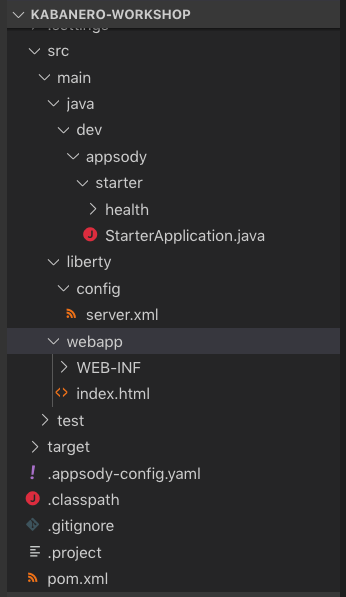

# Introduction to Appsody for cloud-native development

Kabanero is an open source project focused on bringing together key foundational open source technologies into a framework for developing and deploying modern cloud-native applications.  The Kabanero developer experience is based on the Appsody and Eclipse Codewind open source projects enabling developers to use project 'templates' to rapidly create new cloud-native applications, develop and build them in a curated container 'stack' environment and deploy them to Knative/Kubernetes all without the need for container or Kubernetes skills.

This tutorial will give you an introduction to the Appsody part of the Kabanero developer experience. You'll create and deploy a Java MicroProfile based cloud-native application, however, Kabanero provides a number of stacks, including Node.js and Spring Boot and is extensible so others can easily be added. For more information, see [Appsody.dev](https://appsody.dev/).

At the end of this tutorial, you should have a good understanding of how to use Appsody to develop and deploy a cloud-native application.  You'll know how to create a new application, develop and deploy it to Kubernetes and have an appreciation for how Appsody does all the heavy-lifting helping you focus on the task of writing the code.


## Table of Contents
- [Introduction to Appsody for cloud-native development](#introduction-to-appsody-for-cloud-native-development)
  - [Table of Contents](#table-of-contents)
  - [Before You Begin](#before-you-begin)
    - [Pre-requisites](#pre-requisites)
    - [Enable Kubernetes](#enable-kubernetes)
    - [Installing the Appsody CLI](#installing-the-appsody-cli)
      - [Sharing the Appsody Configuration between the CLI and Visual Studio Code - Optional](#sharing-the-appsody-configuration-between-the-cli-and-visual-studio-code---optional)
    - [Pre-requisite checks and caching of large images](#pre-requisite-checks-and-caching-of-large-images)
  - [Developing Cloud-native applications using Appsody](#developing-cloud-native-applications-using-appsody)
    - [Getting to know Appsody](#getting-to-know-appsody)
    - [Creating a new Project with Appsody](#creating-a-new-project-with-appsody)
    - [Live coding with Appsody](#live-coding-with-appsody)
    - [Deploying to Kubernetes](#deploying-to-kubernetes)

## Before You Begin
Before you get started, there are a number of pre-reqs you'll need to install.  These are the pre-reqs for developing a Java MicroProfile application using Kabanero.  Different pre-reqs will be required for other application stacks.

### Pre-requisites

For **Windows users** only: 
* Due to the Docker Desktop dependency mentioned below, this workshop requires Windows users to have either a Windows 10 Pro or Windows 10 Enterprise installation
* Whereas the developer experience for Kabanero supports Windows users, this workshop also covers the experience for Kabanero architects, which depends on a Linux shell environment. The instructions for this workshop have been tested with [Cygwin](https://www.cygwin.com/).
* Ensure your Cygwin home directory matches your Windows home directory, as described in [this blog entry](https://ryanharrison.co.uk/2015/12/01/cygwin-change-home-directory.html).
* The workshop content has not been validated against the [Windows Subsystem for Linux (WSL)](https://docs.microsoft.com/en-us/windows/wsl) . The Docker CLI running inside WSL requires special settings to communicate with Docker Desktop running on Windows, and that configuration is outside the scope of the validated instructions.

For all users, you need to install the following pre-requisites to complete this tutorial:

* [A Java 8 JDK Installation](https://adoptopenjdk.net/?variant=openjdk8&jvmVariant=openj9)
* [Apache Maven](https://maven.apache.org/)
* Docker Desktop
  * [Windows Docker Installation](https://docs.docker.com/docker-for-windows/)
  * [MacOS Docker Installation](https://docs.docker.com/docker-for-mac/)
* [Visual Studio Code](https://code.visualstudio.com/)

### Enable Kubernetes

You will need to enable Kubernetes as this is disabled by default in Docker Desktop. This can be done by going to **Preferences**, navigating to the **Kubernetes** tab, and checking **Enable Kubernetes**.

### Installing the Appsody CLI
Depending on your operating system, the installation process for the **Appsody CLI** will differ. To correctly install **Appsody** for your operating system, view the following [link](https://appsody.dev/docs/getting-started/installation).

Verify that the CLI tool is installed correctly by executing the following into your terminal:

```
$ appsody
```

#### Sharing the Appsody Configuration between the CLI and Visual Studio Code - Optional

While this is optional, it is recommended. Rather than having **Appsody CLI** projects stored separately to those you may create in an editor such as **Visual Studio Code** or **Eclipse**, updating the **Appsody** configuration file will enable you to work on your projects across both the CLI and editor.

To share the Appsody configuration, follow the instructions at [this repository](https://github.com/kabanero-io/appsodyExtension#optional-using-the-same-appsody-configuration-between-local-cli-and-codewind).

### Pre-requisite checks and caching of large images

This step will ensure your environment has all the prerequisites installed and running.

In addition to checking prerequisites, this step will also cache large images into your local system. The cached content will save you valuable time at the beginning of the workshop.

```
curl -sL https://github.com/gcharters/kabanero-dev-getting-started/releases/download/0.0.2/workshop-setup.sh | bash
```


## Developing Cloud-native applications using Appsody

### Getting to know Appsody

We're going to start by trying out the developer experience Appsody provides and then we'll move on to use Eclipse Codewind.

Let's take a look at what Appsody provides in terms of capabilities.  In a command prompt, type:

```
appsody
```

You should see output similar to the following:

```
charters@Grahams-MBP-2 ~ $ appsody
The Appsody command-line tool (CLI) enables the rapid development of cloud native applications.

Complete documentation is available at https://appsody.dev

Usage:
  appsody [command]

Available Commands:
  build       Locally build a docker image of your appsody project
  completion  Generates bash tab completions
  debug       Run the local Appsody environment in debug mode
  deploy      Build and deploy your Appsody project to your Kubernetes cluster
  extract     Extract the stack and your Appsody project to a local directory
  help        Help about any command
  init        Initialize an Appsody project with a stack and template app
  list        List the Appsody stacks available to init
  operator    Install or uninstall the Appsody operator from your Kubernetes cluster.
  repo        Manage your Appsody repositories
  run         Run the local Appsody environment for your project
  stop        Stops the local Appsody docker container for your project
  test        Test your project in the local Appsody environment
  version     Show Appsody CLI version

Flags:
      --config string   config file (default is $HOME/.appsody/.appsody.yaml)
      --dryrun          Turns on dry run mode
  -h, --help            help for appsody
  -v, --verbose         Turns on debug output and logging to a file in $HOME/.appsody/logs

Use "appsody [command] --help" for more information about a command.
```

The Appsody CLI has a number of **Commands**.  The majority of these commands are for working  with stacks: build, debug, run stop, test, and extract, list.

Let's take a look at what stacks we have available by entering:

```
appsody list
```

This command lists the available stacks and you should see something like:

```
charters@Grahams-MBP-2 ~ $ appsody list

REPO                 	ID                        	VERSION  	TEMPLATES	DESCRIPTION                                              
appsodyhub           	java-microprofile         	0.2.11   	*default 	Eclipse MicroProfile using OpenJ9 and Maven              
appsodyhub           	java-spring-boot2         	0.3.8    	*default 	Spring Boot using OpenJ9 and Maven                       
appsodyhub           	nodejs                    	0.2.5    	*simple  	Runtime for Node.js applications                         
appsodyhub           	nodejs-express            	0.2.5    	*simple  	Express web framework for Node.js                        
appsodyhub           	nodejs-loopback           	0.1.3    	*scaffold	LoopBack API framework for Node.js                       
appsodyhub           	swift                     	0.1.4    	*simple  	Runtime for Swift applications
```

You'll see that with the stacks available, we can develop new cloud-native applications using Java, Node or Swift, with a number of different, popular frameworks.

These are the default stacks that Appsody provides.  We're going to use a custom stack and to do so we need to take a look at where the stacks come from.  This is where the concept of repositories comes in.  Type the following:

```
appsody repo list
```

You should see an output similar to this:

```
charters@Grahams-MBP-2 ~ $ appsody repo list

NAME                 	URL                                                                                    
*appsodyhub          	https://raw.githubusercontent.com/appsody/stacks/master/index.yaml                     
```

`Appsodyhub` is the location where the appsody project releases its stacks.  The `*` indicates that this is the default repository.

We're going to use a custom stack created for this workshop.  Anybody can write a stack or customize a stack for use by others. Maybe you want to add support for another language or framework, or perhaps your company has additional governance requirements that you want to add into an existing stack.  We'll go into more details on stack development later, but for now, let's add in the stack we'll use in this part of the workshop.

As part of the setup for the workshop, you cloned a github repository and built a project that contained the new stack. Let's go to the output of that build:

```
workshop_dir=$(echo ~)"/workspace/kabanero-workshop"
cd ${workshop_dir}/stacks/ci/assets
```

If you list the contents of that directory, you should see something like this:

```
charters@Grahams-MBP-2 assets (master) $ ls
experimental-index-local.yaml
experimental-index.yaml
experimental.java-microprofile-dev-mode.templates.default.tar.gz
experimental.java-microprofile-dev-mode.v0.2.10.templates.default.tar.gz
experimental.java-microprofile-dev-mode.v0.2.6.templates.default.tar.gz
experimental.java-spring-boot2-liberty.templates.default.tar.gz
experimental.nodejs-functions.templates.simple.tar.gz
experimental.nodejs-loopback.templates.scaffold.tar.gz
experimental.quarkus.templates.default.tar.gz
incubator-index-local.yaml
incubator-index.yaml
incubator.java-microprofile.templates.default.tar.gz
incubator.java-spring-boot2.templates.default.tar.gz
incubator.java-spring-boot2.templates.kotlin.tar.gz
incubator.nodejs-express.templates.simple.tar.gz
incubator.nodejs-express.templates.skaffold.tar.gz
incubator.nodejs.templates.simple.tar.gz
incubator.swift.templates.simple.tar.gz
stable-index-local.yaml
stable-index.yaml
```

This contains the stack packages (.tar.gz files) and local/remote repository files for the `stable`, `incubator` and `experimental` stacks.  The stack we want to use is in the `experimental` repository.

Let's add the local repository definition to the set of repositories that the Appsody CLI can use:

```
appsody repo add workshop file://${workshop_dir}/stacks/ci/assets/experimental-index-local.yaml
```

Check the repository has been added:

```
appsody repo list
```

You should see:

```
charters@Grahams-MBP-2 assets (master) $ appsody repo list

NAME       	URL                                                                                      
*appsodyhub	https://raw.githubusercontent.com/appsody/stacks/master/index.yaml                       
workshop   	file:///Users/charters/workspace/kabanero-workshop/stacks/ci/assets/experimental-index-local.yaml
```

Let's see what stacks we now have available:

```
appsody list
```

You should now see an entry for a stack called `java-microprofile-dev-mode` from the `workshop` repository.

```
charters@Grahams-MBP-2 ~ $ appsody list

REPO      	ID                        	VERSION  	TEMPLATES	DESCRIPTION                                              
appsodyhub	java-microprofile         	0.2.11   	*default 	Eclipse MicroProfile using OpenJ9 and Maven              
appsodyhub	java-spring-boot2         	0.3.8    	*default 	Spring Boot using OpenJ9 and Maven                       
appsodyhub	nodejs                    	0.2.5    	*simple  	Runtime for Node.js applications                         
appsodyhub	nodejs-express            	0.2.5    	*simple  	Express web framework for Node.js                        
appsodyhub	nodejs-loopback           	0.1.3    	*scaffold	LoopBack API framework for Node.js                       
appsodyhub	swift                     	0.1.4    	*simple  	Runtime for Swift applications                           
workshop  	java-microprofile-dev-mode	0.2.10   	*default 	Eclipse MicroProfile on Open Liberty & OpenJ9 using Maven
```

We're now ready to start creating applications using the new Appsody stack.  

### Creating a new Project with Appsody

Make a directory to contain your project:

```
mkdir -p ~/workspace/kabanero-workshop/java-example
cd ~/workspace/kabanero-workshop/java-example
```

Create the new project.  This project will using the Java MicroProfile APIs defined at Eclipse and will run on the open source Open Liberty runtime running on Eclipse Open J9.

```
appsody init workshop/java-microprofile-dev-mode
```

When the build completes, you should see something like:

```
...
[InitScript] [INFO] ------------------------------------------------------------------------
[InitScript] [INFO] BUILD SUCCESS
[InitScript] [INFO] ------------------------------------------------------------------------
[InitScript] [INFO] Total time: 0.800 s
[InitScript] [INFO] Finished at: 2019-09-02T15:52:41+01:00
[InitScript] [INFO] ------------------------------------------------------------------------
Successfully initialized Appsody project
```

Open up the project in VS Code.  

```
code .
```

If you prefer, you can use other IDEs. To experience the incremental update during development you will need an IDE that automatically compiles Java source files each time they are saved.  VS Code (with the Red Hat `Language Support for Java`), Eclipse and IntelliJ IDEA are all known to work.

Expand the project `src` and you should see a structure and code like this:



This is intentionally a 'bare-bones' project so as to avoid the need to delete unnecessary files.  It contains a JAX-RS Application class called `StarterApplication.java`, and Liberty server configuration, `server.xml`, and static html file, `index.html` and the project build file, `pom.xml`

### Live coding with Appsody

Let's start the new application ready to make some edits.  Enter the following command:

```
appsody run
```

The run command for this stack has been set up to ensure the compiled code is up to date and then launch the Open Liberty server with the application deploy in `dev mode`.  Dev mode is Open Liberty's support for hot application update during development.

After a while you should see output similar to the following: 

```
[Container] [INFO] [AUDIT   ] CWWKE0001I: The server defaultServer has been launched.
[Container] [INFO] [AUDIT   ] CWWKZ0058I: Monitoring dropins for applications.
[Container] [INFO] [AUDIT   ] CWWKS4104A: LTPA keys created in 2.186 seconds. LTPA key file: /project/user-app/target/liberty/wlp/usr/servers/defaultServer/resources/security/ltpa.keys
[Container] [INFO] [AUDIT   ] CWPKI0803A: SSL certificate created in 6.720 seconds. SSL key file: /project/user-app/target/liberty/wlp/usr/servers/defaultServer/resources/security/key.jks
[Container] [INFO] [AUDIT   ] CWWKT0016I: Web application available (default_host): http://499c2f47b921:9080/metrics/
[Container] [INFO] [AUDIT   ] CWWKT0016I: Web application available (default_host): http://499c2f47b921:9080/health/
[Container] [INFO] [AUDIT   ] CWWKT0016I: Web application available (default_host): http://499c2f47b921:9080/openapi/ui/
[Container] [INFO] [AUDIT   ] CWWKT0016I: Web application available (default_host): http://499c2f47b921:9080/ibm/api/
[Container] [INFO] [AUDIT   ] CWWKT0016I: Web application available (default_host): http://499c2f47b921:9080/jwt/
[Container] [INFO] [AUDIT   ] CWWKT0016I: Web application available (default_host): http://499c2f47b921:9080/openapi/
[Container] [INFO] [ERROR   ] CWWKO1650E: Validation of the OpenAPI document produced the following error(s): 
[Container] [INFO]                                                                                                                
[Container] [INFO]  - Message: Required "paths" field is missing or is set to an invalid value, Location: #
[Container] [INFO] 
[Container] [INFO] [AUDIT   ] CWWKT0016I: Web application available (default_host): http://499c2f47b921:9080/
[Container] [INFO] [AUDIT   ] CWWKZ0001I: Application starter-app started in 11.185 seconds.
[Container] [INFO] CWWKM2015I: Match number: 1 is [9/2/19 16:09:40:504 GMT] 00000033 com.ibm.ws.app.manager.AppMessageHelper                      A CWWKZ0001I: Application starter-app started in 11.185 seconds..
[Container] Exception in thread "Thread-9" java.util.NoSuchElementException: No line found
[Container] 	at java.util.Scanner.nextLine(Scanner.java:1540)
[Container] 	at net.wasdev.wlp.common.plugins.util.DevUtil$HotkeyReader.readInput(DevUtil.java:582)
[Container] 	at net.wasdev.wlp.common.plugins.util.DevUtil$HotkeyReader.run(DevUtil.java:572)
[Container] 	at java.lang.Thread.run(Thread.java:819)
[Container] [INFO] [AUDIT   ] CWWKF0012I: The server installed the following features: [appSecurity-2.0, cdi-2.0, concurrent-1.0, distributedMap-1.0, jaxrs-2.1, jaxrsClient-2.1, jndi-1.0, json-1.0, jsonb-1.0, jsonp-1.1, jwt-1.0, microProfile-3.0, mpConfig-1.3, mpFaultTolerance-2.0, mpHealth-2.0, mpJwt-1.1, mpMetrics-2.0, mpOpenAPI-1.1, mpOpenTracing-1.3, mpRestClient-1.3, opentracing-1.3, servlet-4.0, ssl-1.0].
[Container] [INFO] [AUDIT   ] CWWKF0011I: The defaultServer server is ready to run a smarter planet. The defaultServer server started in 58.761 seconds.
```

The generated project has maven coordinates (`groupId`, `artifactId`, and `version`) that are the same for each project generated.  To avoid clashes we should change them.  Edit the `pom.xml` file and change:

```
    <groupId>dev.appsody.starter.java-microprofile</groupId>
```

To:

```
    <groupId>kabanero-workshop</groupId>
```

Save the file.  You'll see a message that `liberty:dev` mode does not handle `pom.xml` changes.  Instead, the Appsody stack has been configured to trigger a maven rebuild.  Wait for the rebuild to complete and the message to say the application has started to be printed:

```
A CWWKZ0001I: Application starter-app started in 9.393 seconds..
```

Let's now make a code change.  The Java MicroProfile stack we're using takes advantage of `liberty:dev` mode to dynamically update the running application without needing a lengthy maven rebuild. 

First, navigate to the JAX-RS application endpoint to confirm that there are no JAX-RS resources available.  Open the following link in your browser:

http://localhost:9080/starter

You should see an `HTTP 500` error with the following message stating that there are no `provider` or `resource` classes associated with the application:

```
Error 500: javax.servlet.ServletException: At least one provider or resource class should be specified for application class "dev.appsody.starter.StarterApplication
```


Navigate to the `src/main/java/dev/appsody/starter` directory, and create a file called `StarterResource.java` - this will be our JAX-RS resource. Populate the file with the following code and save it:

```Java
package dev.appsody.starter;

import javax.ws.rs.GET;
import javax.ws.rs.Path;

@Path("/resource")
public class StarterResource {

    @GET
    public String getRequest() {
        return "StarterResource response";
    }
}
```

You should see that upon saving the file the source is compiled and the application updated:

```
[Container] [INFO] Source compilation was successful.
[Container] [INFO] [AUDIT   ] CWWKT0017I: Web application removed (default_host): http://a904f464a04b:9080/
[Container] [INFO] [AUDIT   ] CWWKZ0009I: The application starter-app has stopped successfully.
[Container] [INFO] [AUDIT   ] CWWKT0016I: Web application available (default_host): http://a904f464a04b:9080/
[Container] [INFO] [AUDIT   ] CWWKZ0003I: The application starter-app updated in 1.447 seconds.
```

Now if you browse http://localhost:9080/starter instead of the `HTTP 500` error you should see a `HTTP 404`.  The resource we just added is actually available at a location under `starter.  Browse the following URL to see the resource response:

http://localhost:9080/starter/resource

You should see the response `StarterResource response`

Try changing the message in `StarterResource.java` saving and refreshing the page.  You'll see it only takes a few seconds for the change to take effect.

When you're done, type `Ctrl-C` to end the appsody run. 


### Deploying to Kubernetes

You've finished writing your code and want to deploy to Kubernetes.  The Kabanero project integrates Tekton as a CI/CD pipeline for deploying to Kubernetes (including Knative and Istio).  This enables you to commit your changes to a git repo and have a Tekton pipeline build and potentially deploy the project.

A full Kabanero set-up was considered too much for this workshop, so here we're going to make use of a nice little feature from Appsody, `appsody deploy`.  In the terminal in the root of your project, type:

```
appsody deploy
```

At the end of the deploy, you should see an output like this:

```
Built docker image kabanero-workshop
Using applicationImage of: kabanero-workshop
Attempting to apply resource in Kubernetes ...
Running command: kubectl[apply -f temp-app-deploy.yaml --namespace default]
Deployment succeeded.
Running command: kubectl[get rt kabanero-workshop -o jsonpath="{.status.url}" --namespace default]
Attempting to get resource from Kubernetes ...
Running command: kubectl[get route kabanero-workshop -o jsonpath={.status.ingress[0].host} --namespace default]
Attempting to get resource from Kubernetes ...
Running command: kubectl[get svc kabanero-workshop -o jsonpath=http://{.status.loadBalancer.ingress[0].hostname}:{.spec.ports[0].nodePort} --namespace default]
Deployed project running at http://localhost:30059
```

The very last line tells you where the application is available.  Let's call the resource by opening this endpoint in the browser:

http://localhost:30059/starter/resource

You should now see the response from your JAX-RS resource.

Let's take a look at the deployment.  Enter:

```
kubectl get all
```

You should see an output similar to this:

```
charters@grahams-mbp-2 kabanero-workshop $ kubectl get all
NAME                                    READY   STATUS    RESTARTS   AGE
pod/appsody-operator-5bbbc784b7-rwrf4   1/1     Running   1          6d4h
pod/kabanero-workshop-cc674d6df-npr7c   1/1     Running   0          106m

NAME                        TYPE        CLUSTER-IP      EXTERNAL-IP   PORT(S)          AGE
service/appsody-operator    ClusterIP   10.106.28.94    <none>        8383/TCP         6d4h
service/kabanero-workshop   NodePort    10.111.44.163   <none>        9080:30059/TCP   106m
service/kubernetes          ClusterIP   10.96.0.1       <none>        443/TCP          6d5h

NAME                                READY   UP-TO-DATE   AVAILABLE   AGE
deployment.apps/appsody-operator    1/1     1            1           6d4h
deployment.apps/kabanero-workshop   1/1     1            1           106m

NAME                                          DESIRED   CURRENT   READY   AGE
replicaset.apps/appsody-operator-5bbbc784b7   1         1         1       6d4h
replicaset.apps/kabanero-workshop-cc674d6df   1         1         1       106m
```

The entries with `kabanero-workshop` are your applications.  The `appsody-operator` are those used by Appsody to perform the deployment.

It's worth noting at this point that this deployment was achieved without us having to write, or understand, a Dockerfile or Kubernetes deployment yaml.  

Now list the files in your project directory.  You should see something like this:

```
-rw-r--r--   1 charters  staff   614  3 Sep 15:02 app-deploy.yaml
-rwxr-xr-x   1 charters  staff  7289  3 Sep 11:18 pom.xml
drwxr-xr-x   4 charters  staff   128  2 Sep 18:05 src
drwxr-xr-x  16 charters  staff   512  2 Sep 18:06 target
```

The `app-deploy.yaml` is generated from the stack and used to deploy to Kubernetes.  If you look inside the file, you'll see entries for `liveness` and `readiness` probes, metrics, and the service port.

Check out the `liveness` and `readiness` endpoints by pointing your browser at:

http://localhost:30059/health/live
http://localhost:30059/health/ready

You should see something like:

```json
// 20190903170443
// http://localhost:30059/health/ready

{
  "checks": [
    {
      "data": {
        
      },
      "name": "StarterReadinessCheck",
      "status": "UP"
    }
  ],
  "status": "UP"
}
```

These endpoints are provided by the MicroProfile health checks generated by the project starter.

Finally, let's undeploy the application by entering: 

```
appsody deploy delete
```

You should see an output something like this:

```
charters@grahams-mbp-2 kabanero-workshop $ appsody deploy delete
Deleting deployment using deployment manifest app-deploy.yaml
Attempting to delete resource from Kubernetes...
Running command: kubectl[delete -f app-deploy.yaml --namespace default]
Deployment deleted
```

Check that everything was undeployed using:


```
kubectl get all
```

You should see output similar to this:

```
charters@grahams-mbp-2 kabanero-workshop $ kubectl get all --namespace default
NAME                                    READY   STATUS    RESTARTS   AGE
pod/appsody-operator-5bbbc784b7-rwrf4   1/1     Running   1          6d21h

NAME                       TYPE        CLUSTER-IP     EXTERNAL-IP   PORT(S)    AGE
service/appsody-operator   ClusterIP   10.106.28.94   <none>        8383/TCP   6d21h
service/kubernetes         ClusterIP   10.96.0.1      <none>        443/TCP    6d22h

NAME                               READY   UP-TO-DATE   AVAILABLE   AGE
deployment.apps/appsody-operator   1/1     1            1           6d21h

NAME                                          DESIRED   CURRENT   READY   AGE
replicaset.apps/appsody-operator-5bbbc784b7   1         1         1       6d21h
```

What if you decide you want to see the Container and Kubernetes configuration that Appsody is using, or you want to take your project elsewhere?  You can do this as follows. Enter:

```
appsody extract
```

You should see output similar to:

```
charters@Grahams-MBP-2 kabanero-workshop $ appsody extract
Extracting project from development environment
Running command: docker[pull gcharters/java-microprofile-dev-mode:0.2]
[Warning] Docker image pull failed: exit status 1
Using local cache for image gcharters/java-microprofile-dev-mode:0.2
[Warning] The stack image does not contain APPSODY_PROJECT_DIR. Using /project
Running command: docker[create --name kabanero-workshop-extract -v /Users/charters/.m2/repository:/root/.m2/repository -v /Users/charters/kabanero-workshop/.:/project/user-app gcharters/java-microprofile-dev-mode:0.2]
Running command: docker[cp kabanero-workshop-extract:/project /Users/charters/.appsody/extract/kabanero-workshop]
Running command: docker[rm kabanero-workshop-extract -f]
Project extracted to /Users/charters/.appsody/extract/kabanero-workshop
```

Let's take a look at the extracted project:

```
cd ~/.appsody/extract/kabanero-workshop
ls -al
```

You should see the following:

```
charters@Grahams-MBP-2 kabanero-workshop $ ls -al
total 56
drwxr-xr-x  11 charters  staff   352 30 Aug 16:15 .
drwxr-xr-x   6 charters  staff   192  4 Sep 10:03 ..
-rwxr-xr-x   1 charters  staff    32 20 Aug 13:46 .appsody-init.bat
-rwxr-xr-x   1 charters  staff    44 20 Aug 13:46 .appsody-init.sh
-rw-r--r--   1 charters  staff    42 20 Aug 13:46 .dockerignore
-rw-r--r--   1 charters  staff   380 22 Aug 12:06 .project
drwxr-xr-x   4 charters  staff   128 22 Aug 12:07 .settings
-rw-r--r--   1 charters  staff   813 30 Aug 16:14 Dockerfile
-rw-r--r--   1 charters  staff  3678 30 Aug 14:13 pom.xml
drwxr-xr-x  11 charters  staff   352  3 Sep 15:08 user-app
-rwxr-xr-x   1 charters  staff  2568 30 Aug 12:57 validate.sh
```

These are the files for the project, including those provided by the stack.  For example, the `pom.xml` is the parent pom for your application, and the `Dockerfile` is the one used to build and package the application.  The `user-app` is the maven project for your application.

That's it!  You've seen how Appsody `stacks` and `templates` make it easy to get started with a new project with a curated and consistent dev and production environment. You've also seen how Appsody makes it really easy to build production-ready containers and deploy them to a Kubernetes environment.
